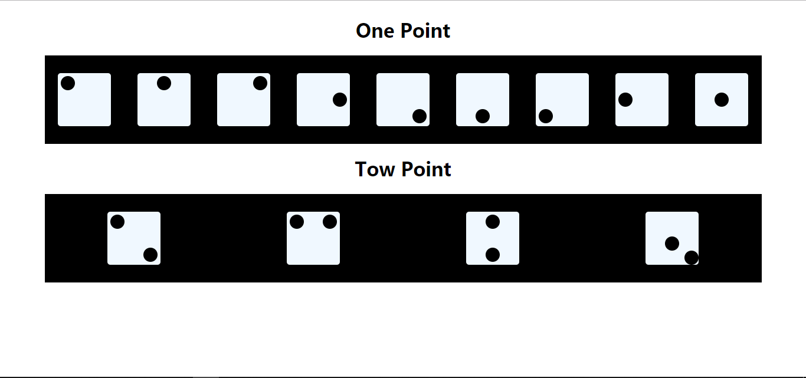

# flex-布局
This is a demo using flex to do layout
# 容器上的6个属性
* flex-direction：   定义主轴的方向（水平或垂直）
* justify-content:   定义项目在主轴上的摆放位置
* align-items：      定义项目在侧轴上的摆放位置
* flex-wrap：        定义项目在主轴上是否换行及换行的规则
* flex-flow：        是flex-direction和flex-wrap的简写形式
* align-content：    定义了多根轴线的对齐方式。如果项目只有一根轴线，该属性不起作用。

